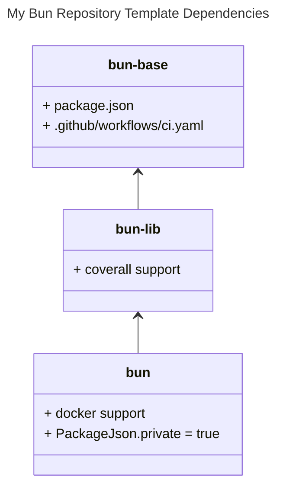

## Document root

### リポジトリテンプレートの依存関係

```mermaid
---
title: My Bun Repository Template Dependencies
---
classDiagram
  class bun-base {
    + package.json
    + .github/workflows/ci.yaml
  }
  class bun-lib {
    + coverall support
  }
  class bun {
    + docker support
    + PackageJson.private = true
  }
  bun-base <-- bun-lib
  bun-lib <-- bun
```
