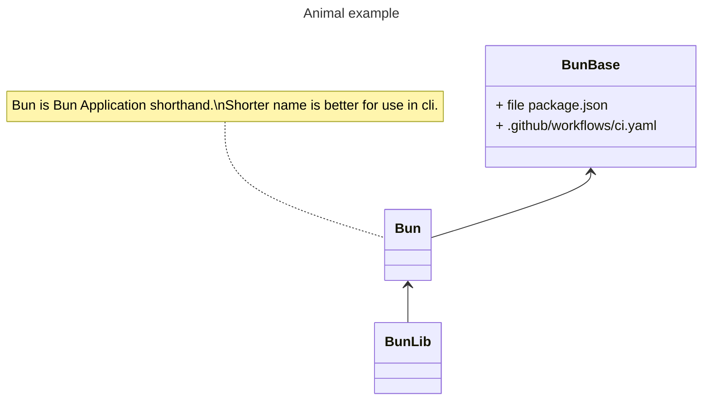

## Document root

### リポジトリテンプレートの依存関係

```mermaid
---
title: Animal example
---
classDiagram
  class BunBase {
    + file package.json
    + .github/workflows/ci.yaml
  }
  note for Bun "Bun is Bun Application shorthand.\nShorter name is better for use in cli."
  BunBase <-- Bun
  Bun <-- BunLib
```
